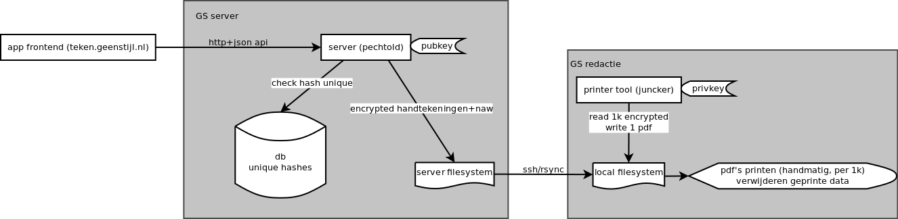
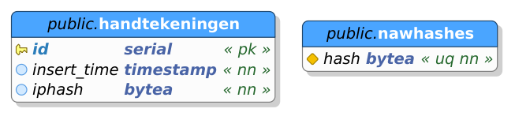

## teken.geenpeil.nl

### pechtold - API server (http api, encryption, storage)

#### API

pechtold draait een HTTP API waarmee nieuwe handtekeningen kunnen worden opgeslagen op de server, om op een later tijdstip uitgeprint te worden.

Voor het opslaan van de gegevens is slechts een simpele HTTP POST call nodig, met in de body JSON data. De JSON data is een object met de volgende velden:

 - `voornaam` (string) - "eerste officiele voornaam"
 - `tussenvoegsel` (string)
 - `achternaam` (string)
 - `geboortedatum` (string) - volgt formaat "dd-mm-yyyy"
 - `geboorteplaats` (string)
 - `straat` (string)
 - `huisnummer` (string) - huisnummer inclusief toevoeging
 - `postcode` (string)
 - `woonplaats` (string)
 - `handtekening` (string) - base64-encoded jpg of png (nog af te spreken)
 - `captchaResponse` (string) - captcha response code, zie onder

De response bevat een JSON object met slechts twee mogelijke velden:

 - `success` (boolean) - indien false zal het object ook de error bevatten
 - `error` (string, optioneel) - error string welke aangeeft wat er mis is met het request, zie onder voor lijst mogelijk errors

Mogelijke error values:

 - `form values missing or invalid` - one or more values are not correct or missing
 - `captcha invalid`
 - `image invalid` - this could be either the base64 decoding, or the image format itself

#### Captcha

Om misbruik te voorkomen gebruiken we reCaptcha v2. Het best is deze te gebruiken met callback functie in de javascript. Dit maakt de app gebruiksvriendelijk en foolproof.

Meer informatie: https://developers.google.com/recaptcha/docs/verify

#### Encryptie van handtekeningen en n.a.w. gegevens

Handtekening en naw gegevens worden asymetrisch encrypted opgeslagen op de server. Op deze manier word gegarandeerd dat er geen opgeslagen persoonsgegevens in handen van hackers kunnen vallen.
De data word ge-encodeerd met protobuf en versleuteld met een RSA public key. De RSA private key is in handen van de GeenStijl redactie zodat deze de gegevens kunnen decrypten en uitprinten.

TODO: data is groter dan mogelijk is te encrypten met RSA. AES toevoegen en extra encoding layer (protobuf) om rsa-encrypted aes-key en aes-encrypted handtekening data op te slaan in 1 files. jay!!

#### Opslag van encrypted gegevens

De gegevens worden direct op ssd opgeslagen. 1 bestand per handtekening met als naam `<ID>.gp`. 1000 bestanden per map. mapnamen zijn genummerd naar `floor(ID / 1000) + 1`.
Op deze manier zijn de gegevens gemakkelijk te downloaden.

#### Hashing van IP en naw

Om dubbele uploads te herkennen word er twee sha256 hashes gemaakt en opgeslagen. De eerste is een hash van het IP address van de client. Deze mag vaker voorkomen, maar zodra dit er erg veel worden zal het opvallen. De tweede is een hash van n.a.w., deze mag maar eenmaal voorkomen. De kans dat twee verschillende personen dezelfde n.a.w. hebben is nihil, en zo'n registratie zal dan ook door de kiesraad worden afgekeurd.

Database structuur: *(`.dbm` file in docs is te bewerken met pgmodeler)*

### juncker - printing application (decryption, pdf rendering)

juncker converteert encrypted data naar printbare pdf's. juncker verwacht daarbij dezelfde directory structure waarmee pechtold opslaat.